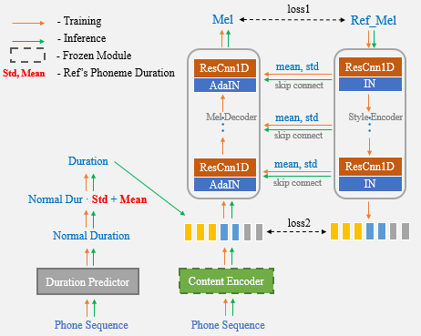

## Unet-TTS: Improving Unseen Speaker and Style Transfer in One-shot Voice Cloning
[](http://choosealicense.com/licenses/mit/)

> English | [中文](README-CN.md)

:exclamation: Now we provide inferencing code and pre-training models. You could generate any text sounds you want.

:star: The model training only uses the corpus of neutral emotion, and does not use any strongly emotional speech.

:star: There are still great challenges in out-of-domain style transfer. Limited by the training corpus, it is difficult for the speaker-embedding or unsupervised style learning (like GST) methods to imitate the unseen data.

:star: With the help of Unet network and AdaIN layer, our proposed algorithm has powerful speaker and style transfer capabilities.

[Infer code](notebook) or [Colab notebook](https://colab.research.google.com/drive/1sEDvKTJCY7uosb7TvTqwyUdwNPiv3pBW#scrollTo=puzhCI99LY_a)

[Demo results](https://cmsmartvoice.github.io/Unet-TTS/)

[Paper link](https://arxiv.org/abs/2109.11115)



---
:smile: The authors are preparing simple, clear, and well-documented training process of Unet-TTS based on Aishell3.
It contains:
- [ ] MFA-based duration alignment
- [ ] Multi-speaker TTS with speaker_embedding-Instance-Normalization, and this model provides pre-training Content Encoder.
- [ ] Unet-TTS training
- [x] One-shot Voice cloning inference
- [ ] C++ inference

 Stay tuned!

---
### Install Requirements
- Install the appropriate TensorFlow and tensorflow-addons versions according to CUDA version. 
- The default is TensorFlow 2.6 and tensorflow-addons 0.14.0.
```shell
pip install TensorFlowTTS
```

### Usage
- see file UnetTTS_syn.py or notebook
```shell
CUDA_VISIBLE_DEVICES=0 python UnetTTS_syn.py
```

```python
from UnetTTS_syn import UnetTTS

models_and_params = {"duration_param": "train/configs/unetts_duration.yaml",
                    "duration_model": "models/duration4k.h5",
                    "acous_param": "train/configs/unetts_acous.yaml",
                    "acous_model": "models/acous12k.h5",
                    "vocoder_param": "train/configs/multiband_melgan.yaml",
                    "vocoder_model": "models/vocoder800k.h5"}

feats_yaml = "train/configs/unetts_preprocess.yaml"

text2id_mapper = "models/unetts_mapper.json"

Tts_handel = UnetTTS(models_and_params, text2id_mapper, feats_yaml)

#text: input text
#src_audio: reference audio
#dur_stat: phoneme duration statistis to contraol speed rate
syn_audio, _, _ = Tts_handel.one_shot_TTS(text, src_audio, dur_stat)
```

### Reference
https://github.com/TensorSpeech/TensorFlowTTS

https://github.com/CorentinJ/Real-Time-Voice-Cloning